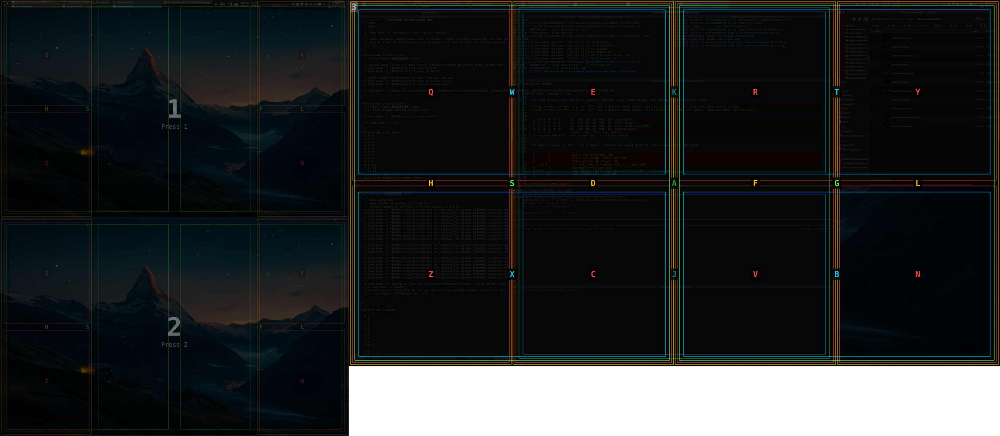

# tile-zone

Keyboard-driven window tiling zones for KDE Plasma 6. A lightweight alternative to KZones that uses direct KWin script injection — no plugins to install, no state to get out of sync.

**tile-zone** consists of two tools:

- **`tile-zone.sh`** — A shell script that tiles the active window to a named zone by injecting a one-shot KWin script via D-Bus. Supports cycling through zones with `next`/`prev`, jumping to a specific zone by number, and moving windows between screens.

- **`tile-zone-picker`** — A Qt6 visual overlay that shows all available zones on every connected screen. Type a letter or click to tile instantly. Zone layouts adapt to each monitor's physical size, detected via EDID.

## The picker in action



*The picker overlay on a 3-monitor setup. The 43" main display (right) is active with the full quarter-based zone layout. Two smaller screens (left) are dimmed — press their number to switch. Zone colors indicate size: red = quarter-height, orange = quarter-fullheight, cyan = half-width, green = half-fullheight.*

## How it works

### Screen-adaptive zone layouts

tile-zone detects each monitor's physical diagonal using `edid-decode` and chooses the appropriate layout:

**Large screens (>= 40", e.g. 43" 4K)** get a quarter-based layout. Vi-style HJKL for edges and center, remaining keys left-to-right:

```
  Q  W  E  R  T  Y      Q1  L50  Q2  Q3  R50  Q4  (top half)
  H  S  D  F  G  L      Q1  L50  Q2  Q3  R50  Q4  (full height, vi H/L)
  Z  X  C  V  B  N      Q1  L50  Q2  Q3  R50  Q4  (bottom half)
  A = center 50% full   K = center top   J = center bottom
```

**Standard screens (< 40")** use a simpler side-column layout with 26% side columns and a 48% center:

```
  Q        Y             top-half left/right 26%
  H  S D F  L            full-height: left/right 26% (vi H/L), S/D/F = L50/C48/R50
  Z        N             bottom-half left/right 26%
```

### Multi-screen support

The picker shows overlays on all connected screens simultaneously:

- The **active window's screen** starts highlighted — its zones respond to letter keys directly
- **Other screens** are dimmed with a number badge — press `1`-`9` to switch
- **Mouse hover** on any screen auto-activates it and highlights the nearest zone
- **Click** to tile, or type the zone letter on the keyboard
- When tiling to a different screen, the window moves there automatically

### Visual cues

- **Colors encode zone shape** so you can tell at a glance how big the tile will be: red (small quarter), orange (tall quarter), cyan (wide half), green (large half)
- **Overlapping zones** are drawn with staggered insets so every outline is distinct
- **Hover highlight** fills the zone and inverts the label so you can preview before committing

### Direct tiling script

`tile-zone.sh` works standalone for keyboard-shortcut-driven tiling:

```bash
tile-zone.sh next              # cycle to next zone
tile-zone.sh prev              # cycle to previous zone
tile-zone.sh 3                 # jump to zone 3
tile-zone.sh screen-next       # move window to same zone on next screen
tile-zone.sh --screen DP-1 5   # tile zone 5 on a specific screen
```

## Installation

### Dependencies

- KDE Plasma 6 (KWin with D-Bus scripting support)
- Qt6 (Widgets, Gui, Core) — for the picker
- `edid-decode` — for physical screen size detection
- `qdbus` — for KWin script injection
- `kdotool` — for window activation ([github.com/jinliu/kdotool](https://github.com/jinliu/kdotool))
- Python 3 — for EDID parsing in the shell script

### Build

```bash
# Build the picker (requires Qt6 development headers)
make tile-zone-picker

# Or manually:
g++ -O2 -std=c++17 -o tile-zone-picker tile-zone-picker.cpp \
    $(pkg-config --cflags --libs Qt6Widgets)
```

`tile-zone.sh` is a standalone bash script — no build needed.

### Setup

1. Copy `tile-zone.sh` and `tile-zone-picker` to a directory in your `$PATH` (e.g. `~/bin/`)
2. Make sure `tile-zone.sh` is executable: `chmod +x tile-zone.sh`
3. Bind to keyboard shortcuts. Example using [kanata](https://github.com/jtroo/kanata):

```lisp
;; In your kanata layer config:
;; Hold ; (right meta layer) + W to open the zone picker
(deflayermap (rmeta_layer)
  w (cmd bash -c "$HOME/bin/tile-zone-picker")
)

;; Hold A (left meta layer) + H/L to cycle zones
(deflayermap (lmeta_layer)
  h (cmd bash -c "$HOME/bin/tile-zone.sh prev")
  l (cmd bash -c "$HOME/bin/tile-zone.sh next")
  n (cmd bash -c "$HOME/bin/tile-zone.sh screen-next")
  p (cmd bash -c "$HOME/bin/tile-zone.sh screen-prev")
)
```

Or bind via KDE's System Settings > Shortcuts > Custom Shortcuts.

## Customizing zones

The zone layouts are defined directly in `tile-zone.sh` (the `zonesForArea` function) and `tile-zone-picker.cpp` (the `buildLargeZones`/`buildSmallZones` functions). Want different proportions, more zones, or a different arrangement? Just ask your friendly LLM to modify them — that's how this project was built in the first place.

## License

GNU General Public License v3.0 — see [LICENSE](LICENSE).
